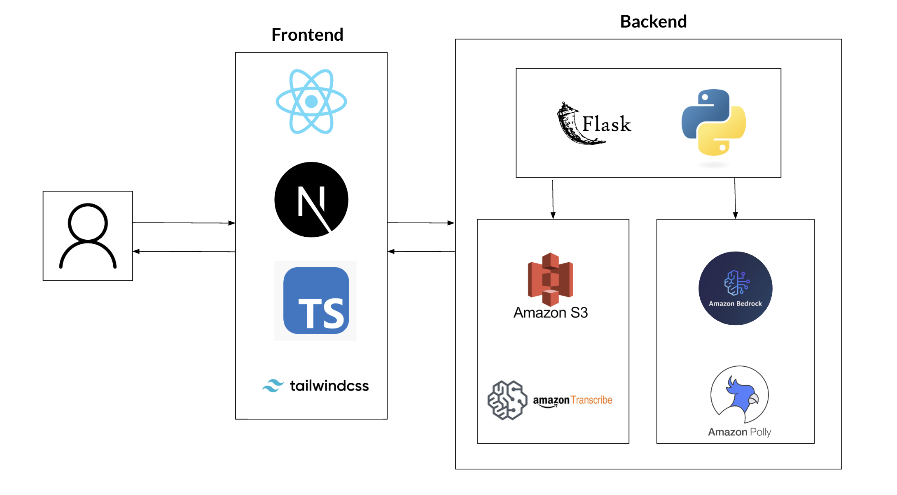

# AWSpeak – Frontend

This is the frontend for **AWSpeak**, an AI-powered interview prep tool that simulates behavioral interviews using personas like Jeff Bezos. Built with **Next.js**, **TypeScript**, and **Tailwind CSS**.

## 🚀 Tech Stack

- [Next.js](https://nextjs.org/) (App Router)
- [React](https://reactjs.org/)
- [TypeScript](https://www.typescriptlang.org/)
- [Tailwind CSS](https://tailwindcss.com/)

- Python 3.11
- Flask
- flask-cors
- boto3 (for AWS integration)
- pygame (for audio support)
- AWS S3 Bucket (audio file storage)
- AWS Polly (text to speech capabilities)
- AWS Transcribe (transcribe speech to text)
- AWS Bedrock (LLM connection to Claude 3.7 Sonnet)




## 🛠 Setup Instructions

1. **Install dependencies**  
   From the `frontend/` directory, run:

   ```bash
   npm install
   ```

2. **Run the development server**

   ```bash
   npm run dev
   ```

3. Open your browser at `http://localhost:3000`

## 📁 Project Structure

```
frontend/
├── app/              # App router pages
├── components/       # Reusable UI components
├── public/           # Static assets
├── styles/           # Tailwind/global CSS
├── tsconfig.json     # TypeScript config
└── package.json      # Project dependencies
```

---

# AWSpeak.AI – Backend

This is the backend for **AWSpeak.AI**, a Flask-based API that powers the AI interview simulator.

## 🔧 Tech Stack


## 🛠 Setup Instructions

1. **Create and activate virtual environment**  
   From the `backend/` directory:

   ```bash
   /opt/homebrew/opt/python@3.11/bin/python3.11 -m venv venv
   source venv/bin/activate
   ```

2. **Install dependencies**

   ```bash
   pip install -r requirements.txt
   ```

3. **Run the Flask server**

   ```bash
   python app.py
   ```

4. The API will be available at:

   ```
   http://localhost:5000
   ```

## 📁 Project Structure

```
backend/
├── app.py              # Flask app entrypoint
├── requirements.txt    # Python dependencies
├── venv/               # Virtual environment (ignored by Git)
```

---

## 🧾 Git Best Practices

- A `.gitignore` file is included in the **project root** to ignore:

  - `node_modules/`
  - `backend/venv/`
  - Python cache files
  - Next.js and build artifacts

- Always activate your virtual environment before running or installing Python packages:

  ```bash
  source backend/venv/bin/activate
  ```

# Team Contributions

Nhan Nguyen:

- Frontend working with Typescript
- Connected frontend to backend
- Tweak backend code to fix minor bugs

Tyler Doan:

- Integrated Bedrock, Polly, Transcribe
- Prompt Engineering for Claude 3.7 Sonnet
- Design and implementation of system architecture

Ethan Vo:

- Backend frontend interaction through API endpoints
- Setup workin environment
- Debug code
- Design and implementation of system architecture

---
